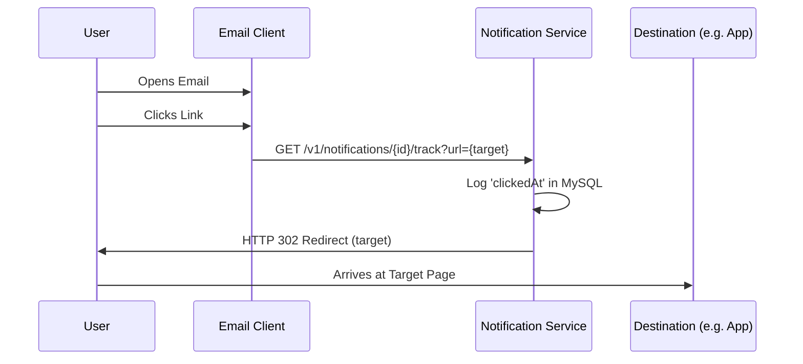

# Analytics & Engagement Tracking

Understanding if a user actually *read* or *clicked* a notification is the final step in a mature notification lifecycle.

## 1. Click Tracking Flow
We use a **Transparent Proxy** pattern to track engagement without disrupting the user experience.



## 2. Implementation Details

### The Tracking Link
During the **Worker** phase, the Template Service scans for a `link` in the data object. It transforms it as follows:

- **Original**: `https://my-app.com/promo`
- **Tracked**: `http://api.myservice.com/v1/notifications/550e8400/track?url=https%3A%2F%2Fmy-app.com%2Fpromo`

### Database Updates
When the endpoint is hit, we perform an atomic update:
```sql
UPDATE Notifications SET clickedAt = NOW() WHERE id = '550e8400';
```

## 3. Future Improvements
- **Open Tracking**: By embedding a 1x1 invisible pixel (Image) in the email, we can track when the email is opened even if the user doesn't click a link.
- **Conversion Tracking**: By passing the `notificationId` all the way to the checkout page, we can attribute actual revenue to a specific notification.
