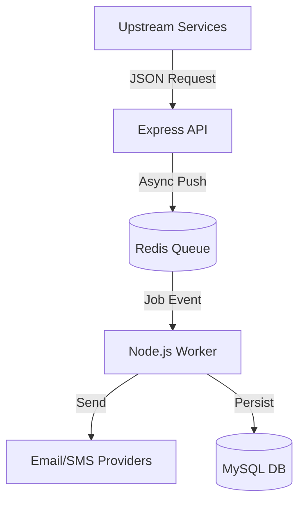
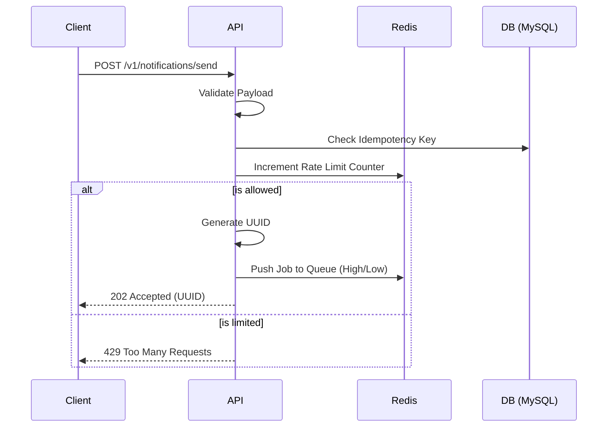
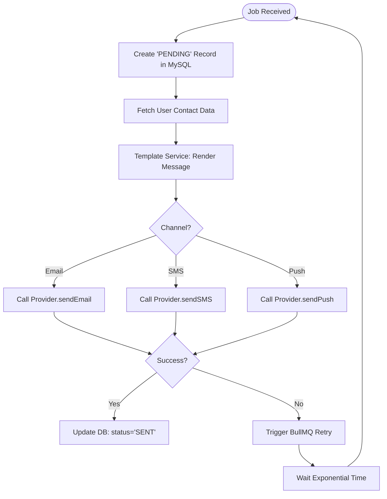

# System Architecture Deep Dive

This document provides a multi-layered view of the Notification Service architecture, from high-level traffic flow to low-level component interaction.

## 1. High-Level Architecture (The Macro View)
The system is built on an **Asynchronous Write-Back** pattern. This maximizes throughput by using Redis as a high-speed buffer.

---

## 2. Component Detail: The API Layer (Producer)
The API's primary goal is **low latency**. It performs only essential checks before offloading the work.

### API Internal Workflow

---

## 3. Component Detail: The Worker Layer (Consumer)
The Worker is the core execution engine. It handles the "heavy lifting" like template rendering and network I/O with third-party providers.

### Worker Internal Workflow

## 4. Scaling Strategy
- **Horizontal Scaling**: You can spin up 10 workers on 10 different servers. They all share the same Redis queue.
- **Priority Isolation**: We run separate worker instances for `high-priority-queue` and `low-priority-queue` to ensure critical alerts are never blocked by newsletters.
