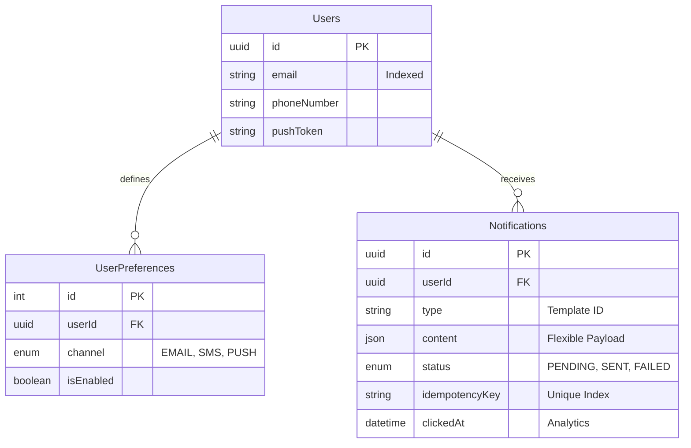

# Data Model Design

The system uses a relational schema with JSON extensions to balance strict integrity with developer flexibility.

## 1. Entity Relationship Overview
We use a **One-to-Many** relationship between Users and their Notifications/Preferences.

---

## 2. Technical Design Decisions

### A. The UUID Primary Key
We chose **UUIDv4** over `AUTO_INCREMENT` integers to allow for:
- **Decentralized Generation**: IDs are generated in the API memory without asking the database, preventing a global lock.
- **Security**: ID values are unguessable, preventing malicious users from iterating through notification history.

### B. The JSON `content` Column
Instead of creating a column for every possible template field (like `orderNumber`, `couponCode`, `shippingAddress`), we store these in a single JSON column.
- **Pros**: Zero database migrations when adding new notification types.
- **Cons**: Slightly harder to query inside the JSON, but since this is an "Insert-Heavy" system, the trade-off is worth it.

### C. Indexing Strategy
- **`userId` (Notifications)**: Crucial for fetching a specific user's history.
- **`idempotencyKey`**: Unique index to prevent duplicates at the hardware level.
- **`email` (Users)**: Unique index for fast user lookups during the API call.
