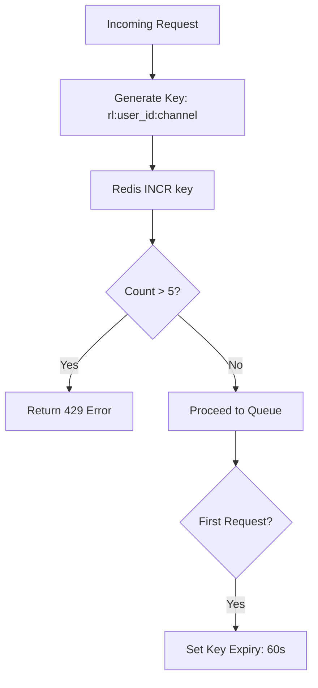
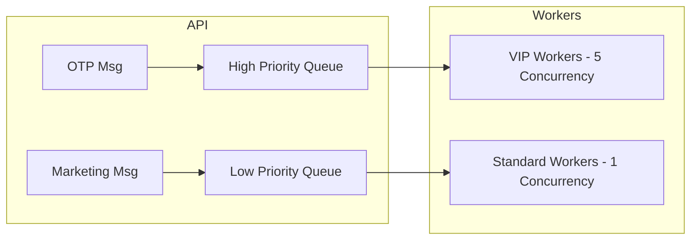

# Reliability & Resilience

In a distributed environment, "Failure is the norm." This document explains how our system survives outages and prevents abuse.

## 1. Rate Limiting Logic (The Shield)
We use a **Fixed Window Counter** pattern in Redis to prevent any single user or service from overwhelming our providers.

## 2. Priority Queues (The Fast Lane)
We solve the "Blocked OTP" problem by separating traffic into different physical queues in Redis.

## 3. Idempotency (The De-duplicator)
To ensure **Exactly-Once** (or At-Least-Once without duplicates) delivery, we use a pre-processing check.

1. **Client** provides an `idempotencyKey`.
2. **Server** checks MySQL for that key.
3. If it exists, the server returns the **old status** immediately.
4. This protects against network retries or "Double-Click" bugs on the frontend.

## 4. Exponential Backoff
When a third-party provider (like Twilio) is down, we don't spam them with retries.
- **Attempt 1**: Immediate
- **Attempt 2**: +1 Second
- **Attempt 3**: +4 Seconds
- **Attempt 4**: +16 Seconds
This gives the external system "Breathing Room" to recover.
